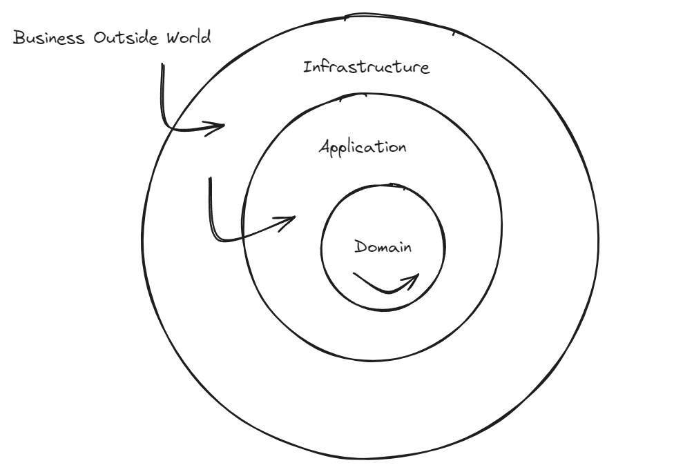
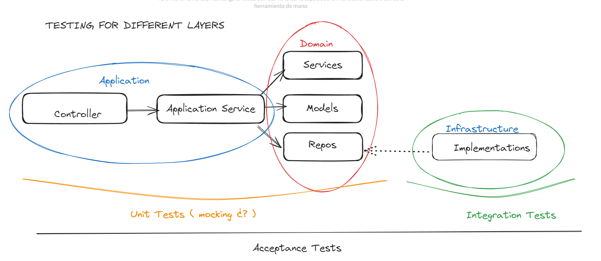

# ports-and-adapters-notes-repository

This repo will be used as a centralized point for all the contents that can have some value having a better understanding of ports and adapters architechture both for back-end and front-end.

Ports and adapters or hexagonal architecture, is a kind of clean architecture in which code is separated into three different layers (folders):

- Domain
- Application
- Infratsructure

Visual excalidraw representation, of how the layers are setup in terms of dependency:

> [!TIP]
> The way I understood this separation of layers is: What is most business dependent goes to the center. As its changeability increases it propagates outwards. In other words, external layers will now the layer right beneath it. This increases the possibility to change, add, update new features without considering the change of internal layers. 👍

## Business dependency in the different layers

### Domain

Domain: All concepts that are related to our context (User, Product, Chart) + Business rules that are exclusively determined by us (domain services) + Ports (or interfaces)

> [!IMPORTANT]
> All elements of the domain layer will have a big business contextual dependency.

### Application

Application: Our app use cases (register user, publish product, add product to chart)

> [!NOTE]
> The differences between domain and application services are explained in the "application-vs-domain-service" directory

### Infrastructure

Infrastructure : Third-party software that will change following external decissions. Here will have the implementations of the abstractions defined in our domain. Dependency-inversion applied. 👍

## Ports and adapters

Ports and adapters may be a better way for describing this architecture. Having an hexagon, may be confusing since one may think that one port only has six adapters. It does not have anything to do with that.

Ports are the domain interfaces (repository patetrn interfaces for example). While adapters are its implementations (for reedish, mongodb...).

This DIP principle has great benefits. Specially, because now our app is completely decoupled (independent and agnostic) from for example, an external ddbb infrastructure.

## Testing

