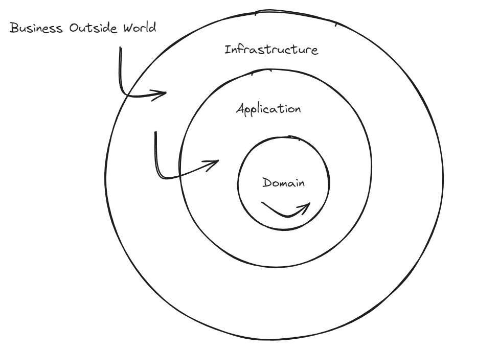

# ports-and-adapters-notes-repository

This repo will be used as a centralized point for all the contents that can have some value having a better understanding of ports and adapters architechture both for back-end front-end.

Ports and adapters or hexagonal architecture, is a kind of clean architecture in which code is separated into three different layers (folders):

- Domain
- Application
- Infratsructure

Visual excalidraw representation, of how the layers are setup in terms of dependency:

> [!TIP]
> The way I understood this separation of layers is: What is most business dependent goes to the center, as its changeability increases it propagates outwards

On each directory, a deeper explanation will be given about each term. However, that "business dependency" thing that I have mentioned, is crucial for understanding how layers are separated and why. So, here it comes a brief explanation, so you better fasten your seat belt.

## Business dependency in the different layers

### Domain

As mentioned in the TIP above, the bigger the business is dependent on one piece of code (that represents a function, entity...whatever) the centered will it be place. Imagine a university software built with this architecture.

For a university to be called one, it needs to have (no discussion) certain things. Students, courses, professors...Those entities (and the information each will have) are, what I call, business dependent. Each uni, will save x amount of information that they think its necessary. This classes, will be part of the domain.

Inside domain we will be saving some abstractions that will be used as contracts for third-party software that we use (interfaces for the repository pattern). On top of that, some functions will also be saved. Specially, those that have a really low changeability over the course of time.

### Application

This layer may be the most confusing one. Some may even think, that it could be removed. The application layer, consists of mainly business use-cases and controllers. Software that could change a bit, but won't be disturbing.

### Infrastructure

This layer will be adapters place. Here, everything that has to do with third-party implementations will appear. Specific databases implementations, UI, I/O... They are the adapters of the ports (domain abstractions).
