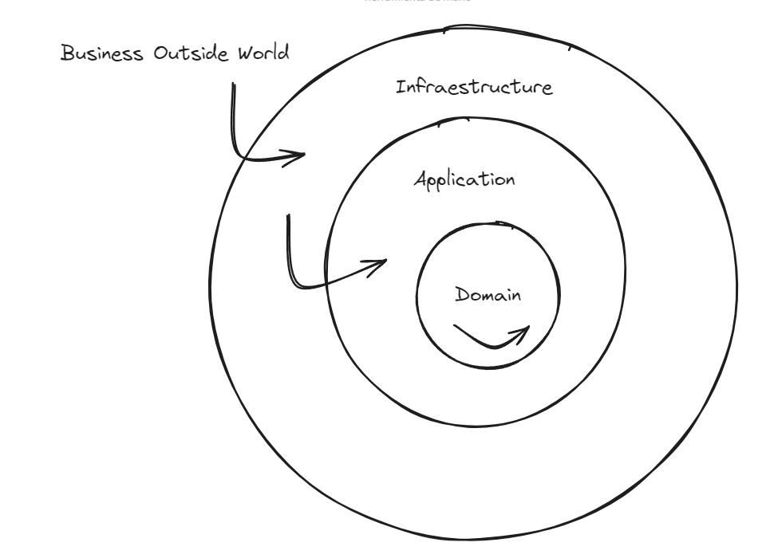

# ports-and-adapters-notes-repository

This repo will be used as a centralized point for all the contents that can have some value having a better understanding of ports and adapters architechture both for back-end front-end.

Ports and adapters or hexagonal architecture, is a kind of clean architecture in which code is separated into three different layers (folders):

- Domain
- Application
- Infraetsructure

Visual excalidraw representation, of how the layers are setup in terms of dependency:

These layers will be separated following, what I think is a crucial concern: Dependency regarding to the internals of a company
